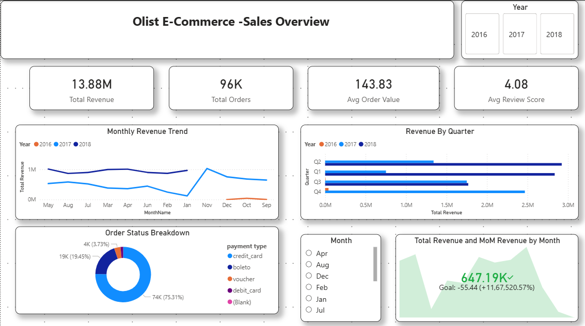
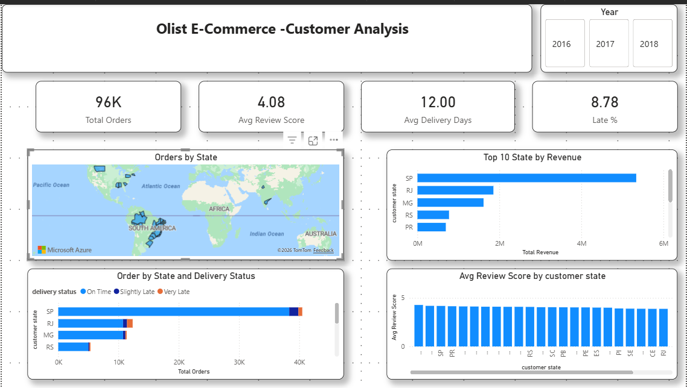
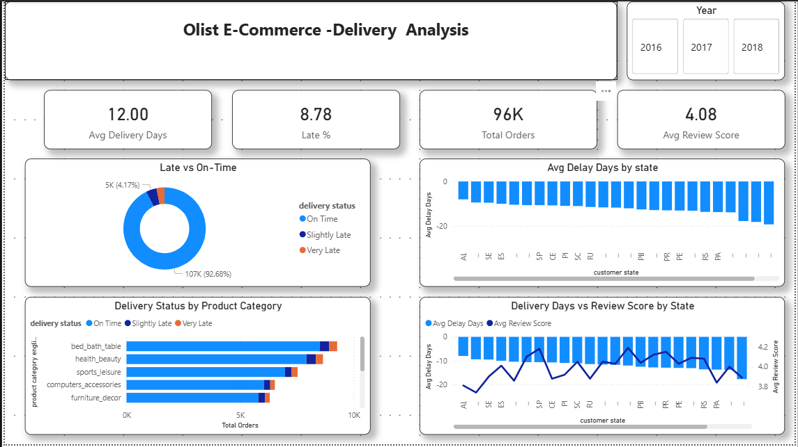
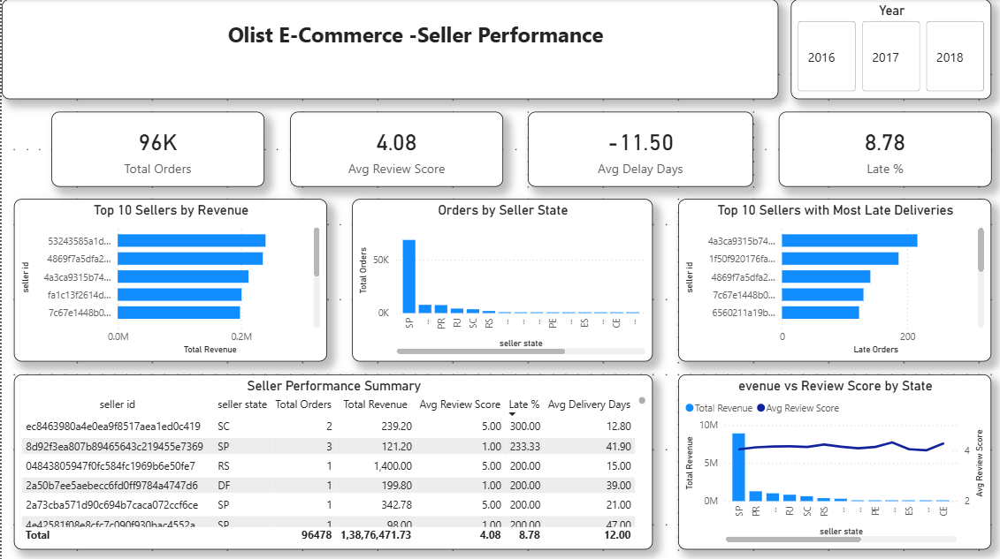
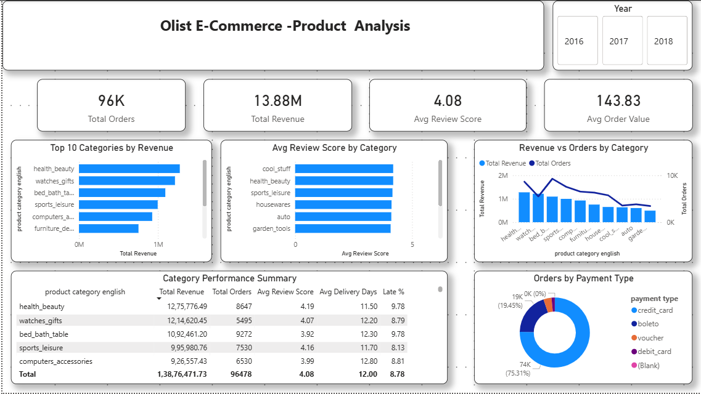

# Olist E-Commerce — End-to-End Data Analysis Project

## Project Overview
This project analyzes real Brazilian e-commerce transaction data from Olist (2016–2018).
The goal is to uncover insights about sales performance, customer behavior, delivery 
efficiency, seller performance and product categories using a full data analyst workflow.

---

## Tools Used
| Tool | Purpose |
|---|---|
| Python (pandas, matplotlib, seaborn) | Data cleaning, feature engineering, EDA |
| SQL Server (SSMS) | Star schema design, analytical queries |
| Power BI | Interactive 5-page dashboard |

---

## Dataset
- **Source** : [Brazilian E-Commerce Public Dataset by Olist — Kaggle](https://www.kaggle.com/datasets/olistbr/brazilian-ecommerce)
- **Size** : 9 CSV files, ~100K orders, 2016–2018
- **Tables** : orders, order_items, customers, sellers, products, payments, reviews, geolocation, category translation

---

## Business Questions Answered

1. How did Olist's revenue trend month by month from 2016 to 2018?
2. Which product categories generate the most revenue and which get the worst reviews?
3. What percentage of orders were delivered late and which states had the worst delays?
4. Who are the top performing sellers and which sellers had the most late deliveries?
5. Does late delivery lead to lower customer review scores?

---

## Project Structure
```
olist-ecommerce-analysis/
│
├── notebooks/
│   └── olist_analysis.ipynb       ← full Python workflow
│
├── sql/
│   └── olist_queries.sql          ← star schema, queries, SP, UDF, view
│
├── dashboard/
│   ├── olist_dashboard.pbix       ← Power BI dashboard file
│   ├── page1_sales_overview.png
│   ├── page2_customer_analysis.png
│   ├── page3_delivery_performance.png
│   ├── page4_seller_performance.png
│   └── page5_product_analysis.png
│
└── README.md
```

---

## Python Notebook — What Was Done
- Loaded all 9 raw CSV files
- Cleaned nulls, fixed date dtypes, removed non-delivered orders
- Engineered new features:
  - `delivery_days` — actual days taken to deliver
  - `delay_days` — difference between actual and estimated delivery
  - `is_late` — binary flag for late orders
  - `order_value` — price + freight per item
  - English product category translation
- Built master analysis table by joining all cleaned tables
- Created 6 EDA charts covering revenue, categories, delivery and reviews
- Exported all clean tables to SQL Server via sqlalchemy

---

## SQL — What Was Done
- Designed a **star schema** with:
  - `FactOrders` — central fact table
  - `DimCustomer`, `DimProduct`, `DimSeller` — dimension tables
- Wrote 8 analytical queries using:
  - GROUP BY aggregations
  - Window functions (RANK, LAG, NTILE)
  - Multi-table JOINs
  - CTEs
- Created a **Stored Procedure** — `GetMonthlyRevenue` for parameterized monthly reporting
- Created a **Scalar UDF** — `fn_DeliveryStatus` to classify orders as On Time / Slightly Late / Very Late
- Created a **View** — `vw_OrderSummary` joining all dimensions for easy querying

---

## Power BI Dashboard — 5 Pages

### Page 1 — Sales Overview
Revenue trend, quarterly performance, payment type breakdown

### Page 2 — Customer Analysis
Orders by state, top states by revenue, delivery status by state

### Page 3 — Delivery Performance
Late vs on time orders, avg delay by state, delivery trend over time

### Page 4 — Seller Performance
Top 10 sellers by revenue, late delivery sellers, seller state analysis

### Page 5 — Product Analysis
Top categories by revenue, review scores by category, payment methods

---

## Dashboard Screenshots

### Page 1 — Sales Overview


### Page 2 — Customer Analysis


### Page 3 — Delivery Performance


### Page 4 — Seller Performance


### Page 5 — Product Analysis


---

## Key Findings
- Olist revenue grew significantly through 2017 with peak sales in November (Black Friday)
- Health & Beauty and Watches & Gifts are the top revenue generating categories
- Approximately 10% of orders were delivered late
- States in the North and Northeast of Brazil experience the longest delivery delays
- Late deliveries consistently receive lower review scores than on time deliveries
- Credit card is the dominant payment method accounting for over 70% of orders

---

## How to Run

### Python
```bash
pip install pandas matplotlib seaborn sqlalchemy pyodbc
```
Open `notebooks/olist_analysis.ipynb` and update `DATA_DIR` to your local dataset path.

### SQL
Open `sql/olist_queries.sql` in SSMS and run against your SQL Server database.

### Power BI
Open `dashboard/olist_dashboard.pbix` in Power BI Desktop.
Note: SQL Server connection will need to be updated to your local instance.

---

*Dataset source: Olist Store — Brazilian E-Commerce Public Dataset on Kaggle*
